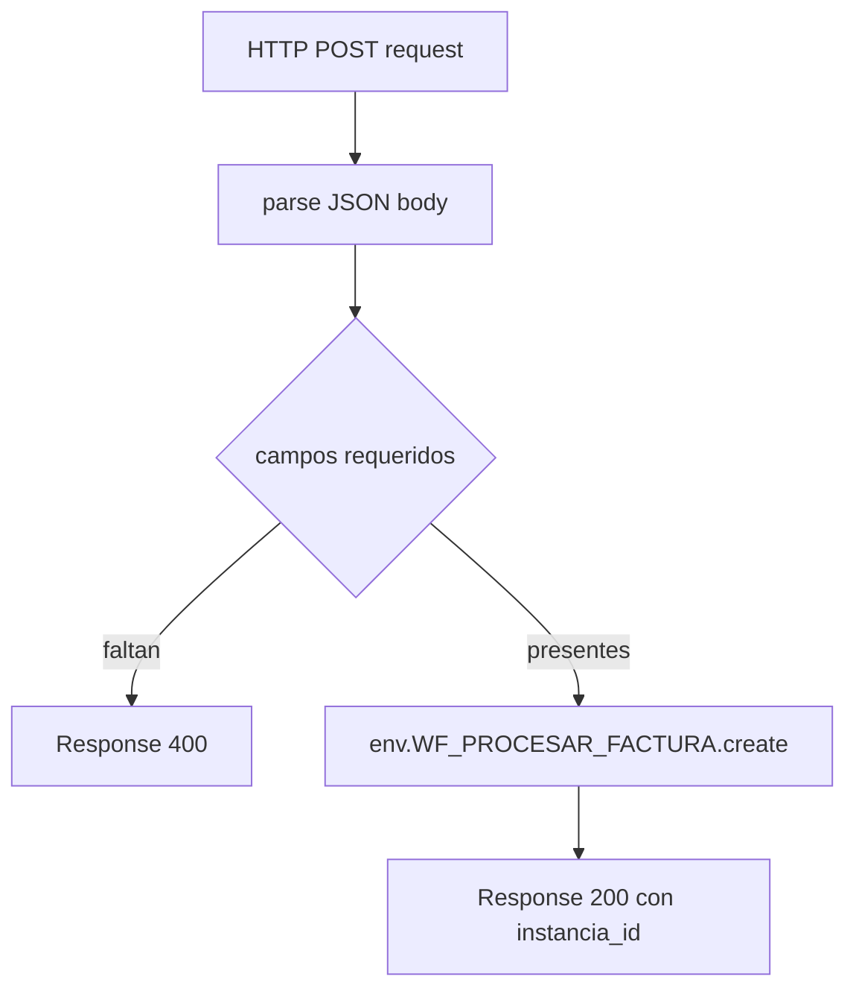

1. Visión general de WK1
- Qué es: Worker HTTP `wf-procesar-factura` que recibe peticiones y lanza un Workflow.
- Dónde empieza: handler `fetch` del Worker en [workers/wf-procesar-factura/src/index.ts](workers/wf-procesar-factura/src/index.ts#L6-L29).
- Dónde termina: creación de instancia del Workflow mediante `env.WF_PROCESAR_FACTURA.create` y respuesta HTTP al cliente [workers/wf-procesar-factura/src/index.ts](workers/wf-procesar-factura/src/index.ts#L22-L27).
- Nota: No hay manejo explícito de PDF ni multipart/form-data en el código actual; la ingesta se limita a un cuerpo JSON con metadatos.

2. Inventario de archivos de WK1
| ID | Ruta | Rol técnico | Momento en WK1 | Reutilizable |
| --- | --- | --- | --- | --- |
| A1 | [workers/wf-procesar-factura/src/index.ts](workers/wf-procesar-factura/src/index.ts#L6-L29) | Entrypoint HTTP `fetch`; ruteo y validación mínima; invoca Workflow | Inicio a fin del flujo | Sí (requiere mismos bindings) |
| A2 | [workers/wf-procesar-factura/src/types/env.ts](workers/wf-procesar-factura/src/types/env.ts#L1-L17) | Tipado de bindings usados por WK1 | Soporte de tipos | Sí (ajustando bindings) |
| A3 | [workers/wf-procesar-factura/wrangler.toml](workers/wf-procesar-factura/wrangler.toml#L1-L27) | Configuración de script y bindings Cloudflare (incluye Workflow y R2) | Config previa al despliegue | Sí (como plantilla de bindings) |

3. Responsabilidad por archivo
| Archivo | Qué hace | Qué NO hace |
| --- | --- | --- |
| [workers/wf-procesar-factura/src/index.ts](workers/wf-procesar-factura/src/index.ts#L6-L29) | Gestiona GET de prueba y POST JSON; valida campos requeridos; crea instancia de Workflow | No parsea multipart/form-data; no lee PDFs; no escribe en R2 dentro de WK1 |
| [workers/wf-procesar-factura/src/types/env.ts](workers/wf-procesar-factura/src/types/env.ts#L1-L17) | Declara bindings `R2_FACTURAS`, `NSKV_SECRETOS`, `NSKV_PROMPTS`, `DB_FAT_EMPRESAS`, `WF_PROCESAR_FACTURA` | No implementa lógica ni validación |
| [workers/wf-procesar-factura/wrangler.toml](workers/wf-procesar-factura/wrangler.toml#L1-L27) | Define main `src/index.ts`, fecha de compatibilidad y bindings de KV, R2, D1 y Workflow | No contiene lógica de ejecución |

4. Entradas y salidas
| Elemento | Entrada (origen/tipo/formato) | Salida (destino/tipo/formato) |
| --- | --- | --- |
| `fetch` POST en [workers/wf-procesar-factura/src/index.ts](workers/wf-procesar-factura/src/index.ts#L13-L27) | Request HTTP con cuerpo JSON esperado `{ invoiceId, r2Key, originalFileName, contentType, fileUrl }`; método POST | Respuesta JSON `{ workflow: "wf-procesar-factura", instancia_id }`; en medio invoca `env.WF_PROCESAR_FACTURA.create({ id: uuid, params: payload })` |
| Validación de campos en `index.ts` | Objeto `payload` ya parseado | `Response 400` si faltan campos |
| `env.WF_PROCESAR_FACTURA.create` | Binding Workflow; recibe `{ id, params: payload }` | Instancia de Workflow (solo `id` devuelto); no se manipula PDF |
| Ruteo GET `/prueba-sheetjs` (fuera de alcance de WK1) | Request GET con token | Respuesta JSON tras escribir XLSX en R2; no afecta WK1 |

5. Elementos Cloudflare usados en WK1
| Binding / recurso | Tipo | Dónde se usa | Para qué se usa |
| --- | --- | --- | --- |
| `WF_PROCESAR_FACTURA` | Workflow binding | [workers/wf-procesar-factura/src/index.ts](workers/wf-procesar-factura/src/index.ts#L22-L27) | Crear instancia de Workflow con los metadatos recibidos |
| `R2_FACTURAS` | R2 bucket | No usado en el flujo WK1 actual; solo en GET de prueba (fuera de alcance) | n/a en WK1 actual |
| `NSKV_SECRETOS`, `NSKV_PROMPTS`, `DB_FAT_EMPRESAS` | KV, KV, D1 | No usados en WK1; solo en GET de prueba o en el Workflow (excluido) | n/a en WK1 |

6. Diagrama de flujo de WK1

7. Exclusiones
- Implementación interna del Workflow [workers/wf-procesar-factura/src/workflow.ts](workers/wf-procesar-factura/src/workflow.ts) y librerías asociadas.
- Ruta GET `/prueba-sheetjs` y librería [workers/wf-procesar-factura/src/lib/xlsx.ts](workers/wf-procesar-factura/src/lib/xlsx.ts) (no forma parte de WK1).
- Cualquier uso de D1, KV, OpenAI, validaciones de PDF o escritura en R2 dentro del Workflow.
- Archivos de `dist/`, `test/`, `Legado/`, `archivos_archivo/`, documentación y scripts de despliegue.

8. Conclusión para reutilización
- Archivos extractables: [workers/wf-procesar-factura/src/index.ts](workers/wf-procesar-factura/src/index.ts#L6-L29) como plantilla de ruteo y llamada a Workflow; [workers/wf-procesar-factura/src/types/env.ts](workers/wf-procesar-factura/src/types/env.ts#L1-L17) para tipar bindings; [workers/wf-procesar-factura/wrangler.toml](workers/wf-procesar-factura/wrangler.toml#L1-L27) como referencia de configuración de bindings.
- Dependencias Cloudflare a recrear: binding de Workflow `WF_PROCESAR_FACTURA` y, si se extiende el flujo, R2/KV/D1 según necesidad. Actualmente WK1 no persiste PDFs ni toca R2, por lo que la recreación mínima exige solo el binding del Workflow y el main `src/index.ts`.
